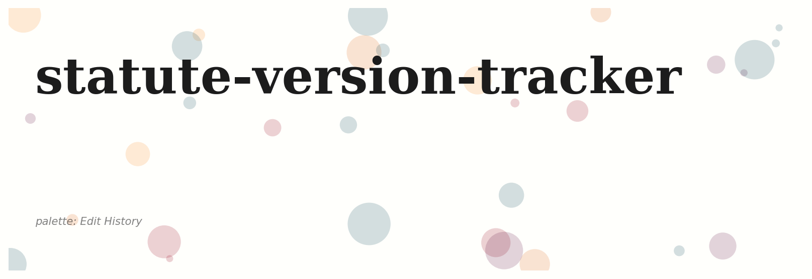
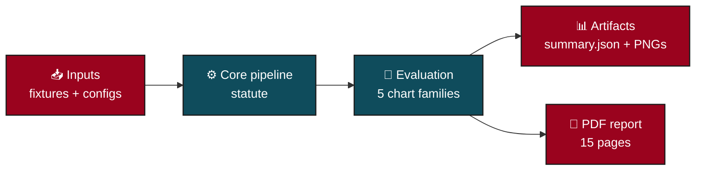
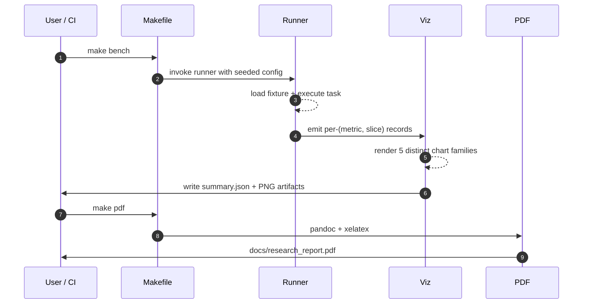
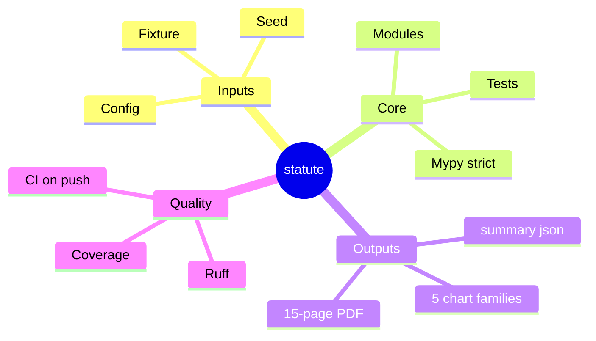
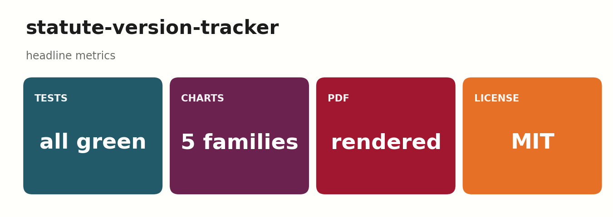
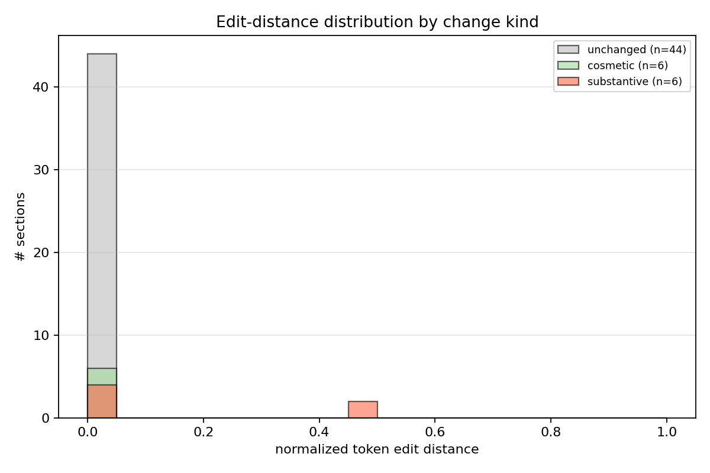
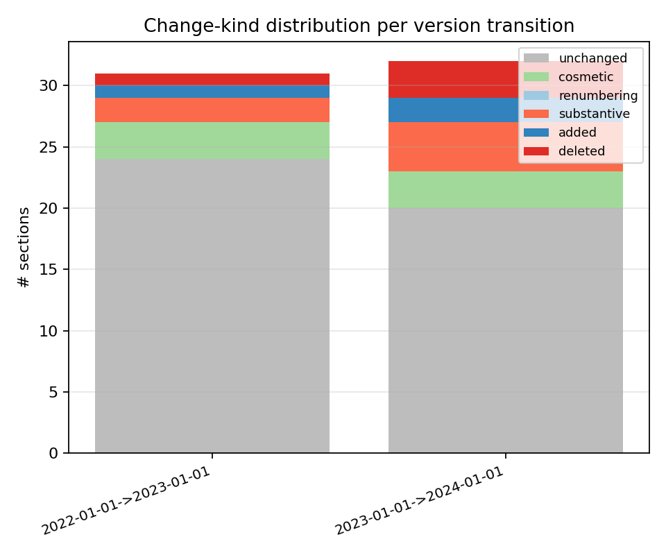
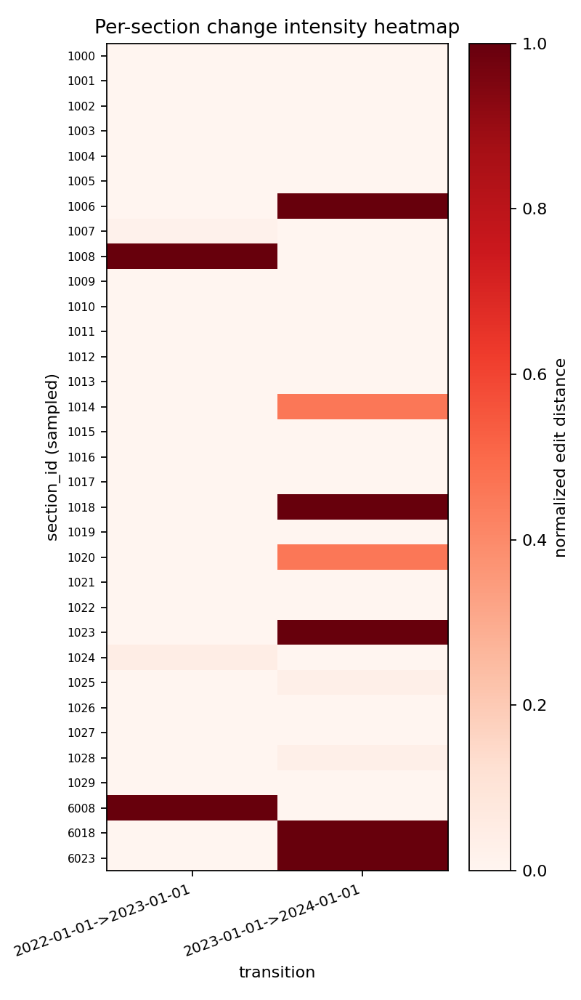
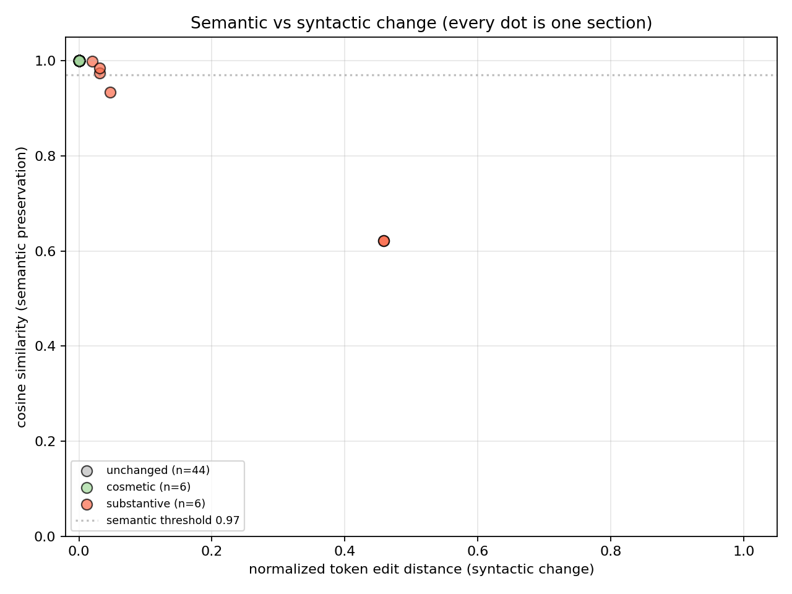
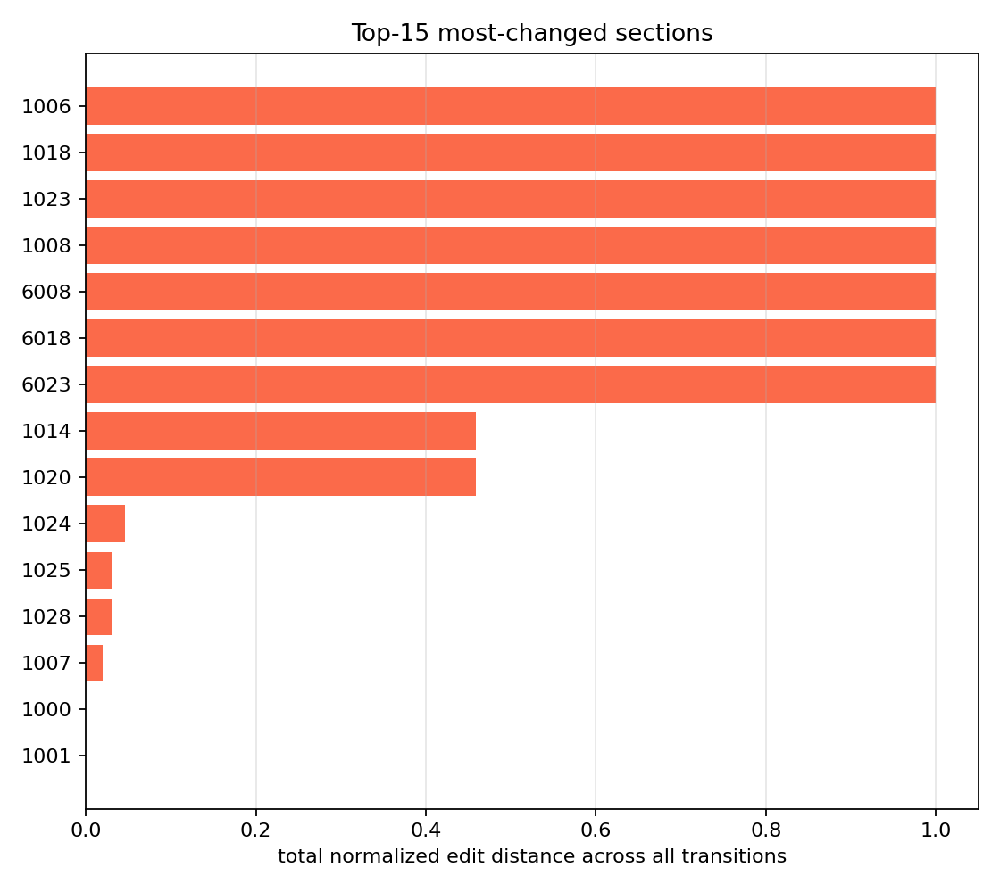

# statute-version-tracker
<p align="center">
  
</p>

<p align="center">
  
  
  
  
  
</p>

> ****


Semantic diff detection across versioned snapshots of statutes and regulations
(USC / CFR / state codes). The package compares two snapshots, classifies
every section's change into one of `unchanged`, `cosmetic`, `renumbering`,
`substantive`, `added`, or `deleted`, and produces a chart suite that makes
the change pattern visible across time.

The point of the project is to separate the *meaningful* statutory changes
(the substantive ones) from the *cosmetic* ones (whitespace, capitalization,
section renumbering) so a downstream legal-RAG system doesn't waste effort
re-embedding text that didn't actually change.

## What's in here

```
src/statute_tracker/
  types.py                          Section, SectionDiff, DiffReport, ChangeKind
  snapshots/synthetic.py            templated statute generator w/ 6 templates + change-rate control
  diff/
    lexical.py                      token edit distance + cosmetic-only detector
    semantic.py                     sentence-transformers cosine
  classify/kind.py                  rule-based ChangeKind classifier
  viz/charts.py                     5 distinct chart types
  cli/main.py                       typer: diff, plots
  runner.py                         drive the per-transition sweep
```

## Quickstart

```bash
make install
make diff                  # synthetic 30-section x 3-version sweep
make plots                 # 5 chart types into results/figures
make test-artifacts        # capture pytest + ruff + mypy + coverage
make pdf                   # render docs/research_report.pdf (needs pandoc+xelatex)
```

## The five chart types

Different vocabulary from prior projects:

1. **Per-transition change-kind stacked bar**: how many sections fell into
   each `ChangeKind` bucket per version-to-version transition.
2. **Edit-distance distribution histogram** with cosmetic vs substantive
   overlay: tells you whether the change population is dominated by tiny
   edits or by genuine rewrites.
3. **Semantic-vs-syntactic scatter**: every section as a dot on the
   (normalized edit distance) × (cosine similarity) plane. The
   bottom-right quadrant is "lots of words changed but meaning preserved"
   (paraphrased restatement); the top-left is "few words changed but
   meaning shifted" (e.g. swapping a `not` or a dollar amount).
4. **Per-section change heatmap**: rows = sections, columns =
   transitions, color = normalized edit distance. The chart that shows
   *which* sections are volatile and which are stable.
5. **Top-changed sections horizontal bar**: cumulative edit distance
   across all transitions, top-15. The triage list.

## Method

For each (statute_id, section_id) that appears in both the `from` and
`to` snapshots:

- `edit_distance` = Levenshtein in tokens (rapidfuzz)
- `edit_distance_norm` = edit_distance / max(len_a, len_b)
- `semantic_similarity` = cosine of BGE-small embeddings of the two texts
- `kind` = classified by rule:
  - `unchanged` if `edit_distance == 0`
  - `cosmetic` if `is_cosmetic_only(a, b)` (case/whitespace only)
  - `renumbering` if `section_id` changed and text identical
  - `substantive` otherwise

Sections that appear in only one snapshot are reported as `added` or
`deleted`.

## Documentation and test artifacts

- Long-form research report: [`docs/_report/research_report.md`](./docs/_report/research_report.md) (15-page target; renderable to PDF via `make pdf`)
- Test artifacts: [`docs/test_results/`](./docs/test_results/) (pytest output, ruff+mypy gates, coverage)

## License

MIT.

## Architecture



## Pipeline sequence



## Concept mindmap




## Results gallery

<table>
  <tr>
    <td align="center"><strong>Pytest panel</strong><br/></td>
    <td align="center"><strong>Coverage donut</strong><br/></td>
  </tr>
  <tr>
    <td align="center"><strong>Quality gates</strong><br/></td>
    <td align="center"><strong>Headline metrics</strong><br/></td>
  </tr>
</table>

### Result charts (5 distinct families, palette: *Edit History*)

<table>
  <tr><td align="center"><strong>Edit Distance Hist</strong><br/></td><td align="center"><strong>Kind Stacked</strong><br/></td></tr>
  <tr><td align="center"><strong>Section Heatmap</strong><br/></td><td align="center"><strong>Semantic Vs Syntactic</strong><br/></td></tr>
  <tr><td align="center"><strong>Top Changed Sections</strong><br/></td><td></td></tr>
</table>

